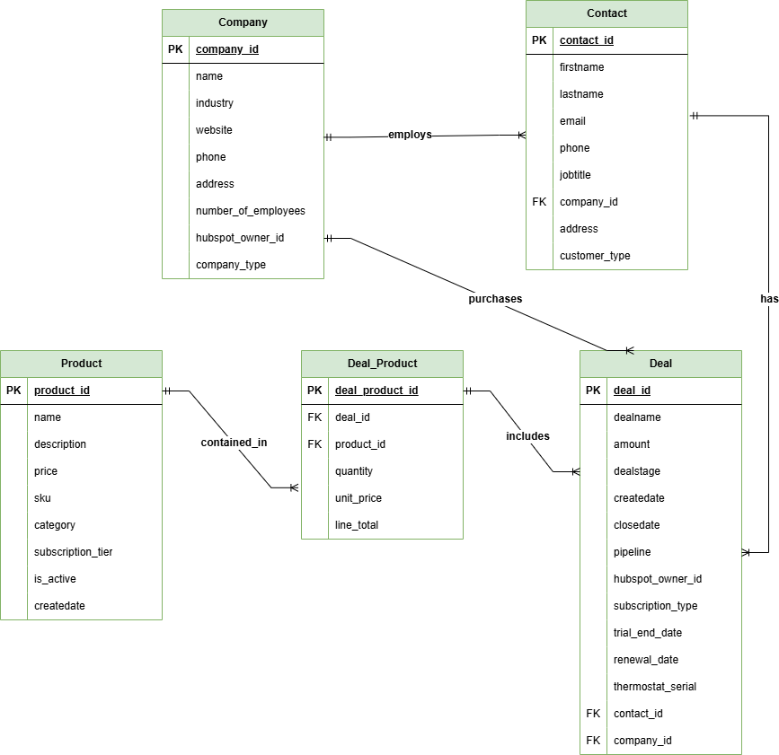

# A. Setup Instructions

## How to run your application locally

The below setup will demonstrate how the **breezy-hubspot-po**c can be executed locally while connecting to HubSpot and Google AI.

## Dependencies or Prerequisites

### Server

- Node.js 16+
- Express.js
- HubSpot API access
- Google Gemini API key (for AI features)

### Frontend

- Angular 25.2.1
- Angular CLI
- Modern web browser such as Chrome

### Expected Environment Variables

Create a .env file in backend directory which will house the Hubspot and Google AI API Keys:
```
HUBSPOT_ACCESS_TOKEN=your_hubspot_access_token

GOOGLE_AI_API_KEY=your_google_gemini_api_key
```

## Clone the repository

Navigate to the GitHub repo listed below and then open the folder - breezy-hubspot-poc
```
git clone https://github.com/revglen/Hubspot-Breezy.git

cd breezy-hubspot-poc
```

## Server (Backend) Setup

The server.js has been modified to support Google AI API which will be wrapped by local APIs within the server.js. These APIs will be called from the front end.

In order to run the application. Ensure that the .env file is created above
```
cd server

npm install

npm start
```

Server runs on [http://localhost:3001](http://localhost:3001/)

## Frontend Setup
```
cd client/breezy-hubspot-poc

npm install

ng serve
```

Application runs on [http://localhost:4200](http://localhost:4200/)

## How to test the integration flow

Once both server and the front end are running, the solution can be tested with the instructions listed below

### List all Contacts Test

- Navigate to "Contacts → Show Contacts"
- This will show all your contacts residing in Hubspot
- If "Deals" button besides each contact is selected then all the free trial and paid subscriptions for that contact are shown

### Add a new Contact Test

- Navigate to "Contacts → Add Contact"
- Fill out customer purchase form
- Submit to create contact in HubSpot
- Verify in "Show Contacts"

### View all Deals Test

- Navigate to "Deal → View All Deals"
- This will bring up all the deals in Hubspot
- All the subscription deals and revenue will be shown for all contacts

### List all Active Paid Subscriptions per Contact Test

- Navigate to "Deal → Active Subscriptions"
- This will bring up screen where a Contact can be selected
- If the contact has any paid subscriptions, the details are displayed on the screen
- If not, a user friendly message is displayed

### Deal Creation Test

- Navigate to "Deals → Create Deal"
- Select a customer and subscription type
- Create deal to track subscription conversion

### AI Insights Test

- Navigate to "AI Insights"
- Select customer and generate insights
- Review AI-powered recommendations

# B. Project Overview

This POC demonstrates how Breezy can integrate their e-commerce platform with HubSpot to track customer data and subscription conversions. The POC simulates Breezy's admin panel where their team can:

- Sync customer data from thermostat purchases to HubSpot contacts
- Track subscription conversions from free trials to paid plans as deals
- View customer subscription status and revenue per customer
- Generate AI-powered insights for customer retention and upsell opportunities

The POC represents a simplified version of what Breezy's engineering team would build into their actual platform. Likewise. The POC demonstrates integration patterns and data architecture.

# C. AI Usage Documentation

## Which AI tools did you use?

- Google Gemini API (free tier) for AI-powered insights

## What tasks did you use AI for?

- Generating customer insights based on subscription patterns
- Providing business intelligence recommendations

## What did you learn? What was challenging?

### Learned

- Effective prompt engineering for technical requirements
- How to structure AI responses for consistent JSON parsing
- Integration patterns for AI services in Angular applications
- Error handling for AI API failures

### Challenging

- Ensuring consistent JSON output from AI responses
- Handling API rate limits and errors gracefully
- Balancing AI-generated code with Angular best practices
- Protecting API keys through server-side implementation

### How did AI help (or not help)?

#### Helpful for

- How to use Google API for rapid prototyping and demonstrations
- A deep dive into Prompt Engineering

#### Limitations

- Required significant validation and error handling
- Required to perform multiple tests and optimisations

# D. HubSpot Data Architecture

## Entity Relationship Diagram (ERD)



- Contact (1) ←→ (M) Deal
- Contact (M) ←→ (1) Company
- Deal (M) ←→ (M) Product (Via Deal_Product)

The relationships depicted are deliberately limited to a high-level representation to stay within the boundaries of this POC. Further entities will be introduced in subsequent phases to achieve a fully holistic model

## Key Objects

- **Contacts**: Individual customers with thermostat ownership tracking
- **Deals**: Subscription conversions with revenue tracking
- **Companies**: B2B customers and distributors
- **Products**: Hardware and subscription catalog

## Deal Pipeline Architecture

### Default Pipeline Stages

- Appointment Scheduled (Initial contact)
- Qualified to Buy (Trial started)
- Presentation Scheduled (Product demo)
- Decision Maker Bought-In (Trial engagement)
- Contract Sent (Subscription offer)
- Closed Won (Active subscription)
- Closed Lost (Trial expired/cancelled)

### Subscription-specific Properties

- subscription_type: monthly|annual|lifetime
- trial_end_date: Track trial expiration
- renewal_date: Auto-renewal tracking
- thermostat_serial: Hardware association

# E. AI Feature Explanation

## Describe your AI-powered feature

The AI-powered customer intelligence feature analyses customer data and subscription patterns to generate actionable business insights. This will exam contact information, deal history, and subscription behaviour to identify potential upsell opportunities, retention risks, and expansion potential.

## Why did you choose this feature?

This feature directly addresses Breezy's need to "be smarter about customer data" by transforming raw HubSpot data into strategic insights. This approach demonstrates how AI can add value to an existing CRM without the need for additional data entry or complex setup.

## How does it make the integration smarter?

- **Predictive Analysis**: Identifies customers likely to churn or upgrade
- **Personalised Recommendations**: Suggests specific actions for each customer
- **Revenue Optimization**: Highlights high-value opportunities
- **Proactive Engagement**: Flags at-risk subscriptions before cancellation

## When would you use AI vs traditional rules/logic?

### Use AI for

- Pattern recognition across large datasets
- Predicting customer behaviour trends
- Generating nuanced recommendations
- Analysing unstructured data patterns

### Use traditional logic for

- Simple if-then business rules
- Fixed pricing calculations
- Basic segmentation rules
- Straightforward workflow automation

# F. Design Decisions

## Technical choices you made and why

- **Angular 25.2.1**: Angular is a modern framework with strong typing and component architecture. I have worked on Angular hence to speed up this POC Angular was leveraged. However, tools such as React have been gained more prominence over Angular lately
- **Standalone Components**: The latest Angular pattern for better performance and simplicity
- **Signals-based State**: The Reactive state management has replaced traditional RxJS complexity
- **Server-side AI**: Protects API keys and enables request optimization
- **Modular Architecture**: Separated concerns pattern was used to separate contacts, deals, AI features, and services. This approach improves scalability, improved flexibility, easier maintenance, and ability to add newer component faster hence speeds up development cycles

## Assumptions you made about Breezy's platform

- Existing Hubspot is API Keys are valid so that data sync can happen
- Customer accounts are created during thermostat purchase process
- Subscription management system can track trial-to-paid conversions
- Basic customer data (name, email, address) is available post-purchase
- Team has technical resources to implement production integration
- Google AI will be leverage for business analysis

## What you'd improve with more time

- Add real-time webhook support for automatic data sync
- Implement comprehensive error handling and retry logic
- Add user authentication and role-based access
- Create comprehensive unit and integration tests
- Build advanced analytics dashboards with charts
- Add bulk operations for contact and deal management
- Build a comprehensive code base that can switch between AI provides rather than depending on a single provider

## What you'd ask the client before building production version

### Technical Integration

- What CRM platform are you using?
- Do you have webhook capabilities for real-time sync?
- What's your current subscription management system?

### Business Requirements

- What specific metrics does your team need to track?
- How do you currently handle customer segmentation?
- What reporting requirements do stakeholders have?

### Scale Considerations

- Expected volume of monthly customer acquisitions?
- Number of team members who will use the admin panel?
- Integration with other existing systems (email, support, accounting)?

### Security & Compliance

- Data retention and privacy requirements?
- Authentication and access control needs?
- Compliance with industry regulations (GDPR, CCPA)?